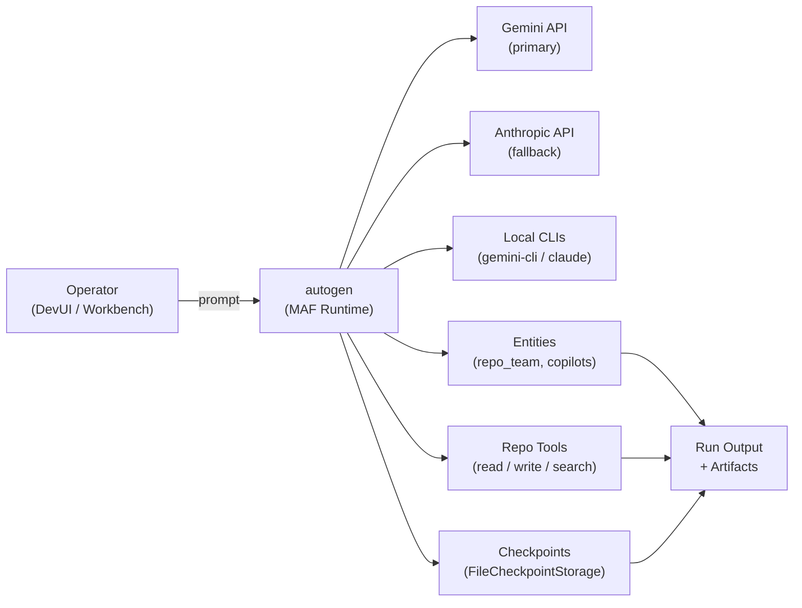

# autogen

[](https://github.com/Coding-Autopilot-System/autogen/actions/workflows/ci.yml)
[](https://www.python.org/)
[](LICENSE)

Part of the [Coding-Autopilot-System](https://github.com/Coding-Autopilot-System) ecosystem:
[gsd-orchestrator](https://github.com/Coding-Autopilot-System/gsd-orchestrator) | [Promptimprover](https://github.com/Coding-Autopilot-System/Promptimprover)

autogen is a Python multi-agent orchestration runtime built on Microsoft Agent Framework — combining a Gemini/Claude provider fallback chain, AG-UI observability, and a local operator workbench for end-to-end autonomous engineering workflows.

## Features

- **Provider fallback chain** — Gemini API (primary) -> Anthropic API -> local CLI fallback; routing policy classifies prompt complexity and selects provider automatically
- **Multi-agent team orchestration** — sequential planner->researcher->implementer->reviewer chain with FileCheckpointStorage for resumable runs
- **Bounded repo tools** — read/list/search/write with enforced scope limits; agents cannot access paths outside the configured repo root
- **AG-UI observability** — DevUI-discoverable workflows expose run state, specialist handoffs, and pause/approval events
- **Human-in-the-loop approvals** — approval policy gates destructive writes; operators review before execution proceeds

## Architecture



## Quickstart

```bash
git clone https://github.com/Coding-Autopilot-System/autogen.git
cd autogen
python -m venv .venv
# Windows: .\.venv\Scripts\Activate.ps1
# macOS/Linux: source .venv/bin/activate
pip install agent-framework python-dotenv
```

Copy `.env.example` to `.env` and set `GEMINI_API_KEY`. See the [Setup Guide](https://github.com/Coding-Autopilot-System/autogen/wiki/Setup-Guide) for full configuration instructions.

## Configuration

| Variable | Required | Default | Description |
|----------|----------|---------|-------------|
| `GEMINI_API_KEY` | Yes | -- | Gemini API key for primary model |
| `MAF_MODEL` | No | `gemini-2.5-flash` | Primary model for agent runs |
| `MAF_FALLBACK_CHAIN` | No | Auto | Comma-separated provider fallback order |
| `ANTHROPIC_API_KEY` | No | -- | Anthropic API key for Claude fallback |

See the [Configuration Reference](https://github.com/Coding-Autopilot-System/autogen/wiki/Configuration-Reference) for the full variable list.

## License

MIT -- see [LICENSE](LICENSE)
