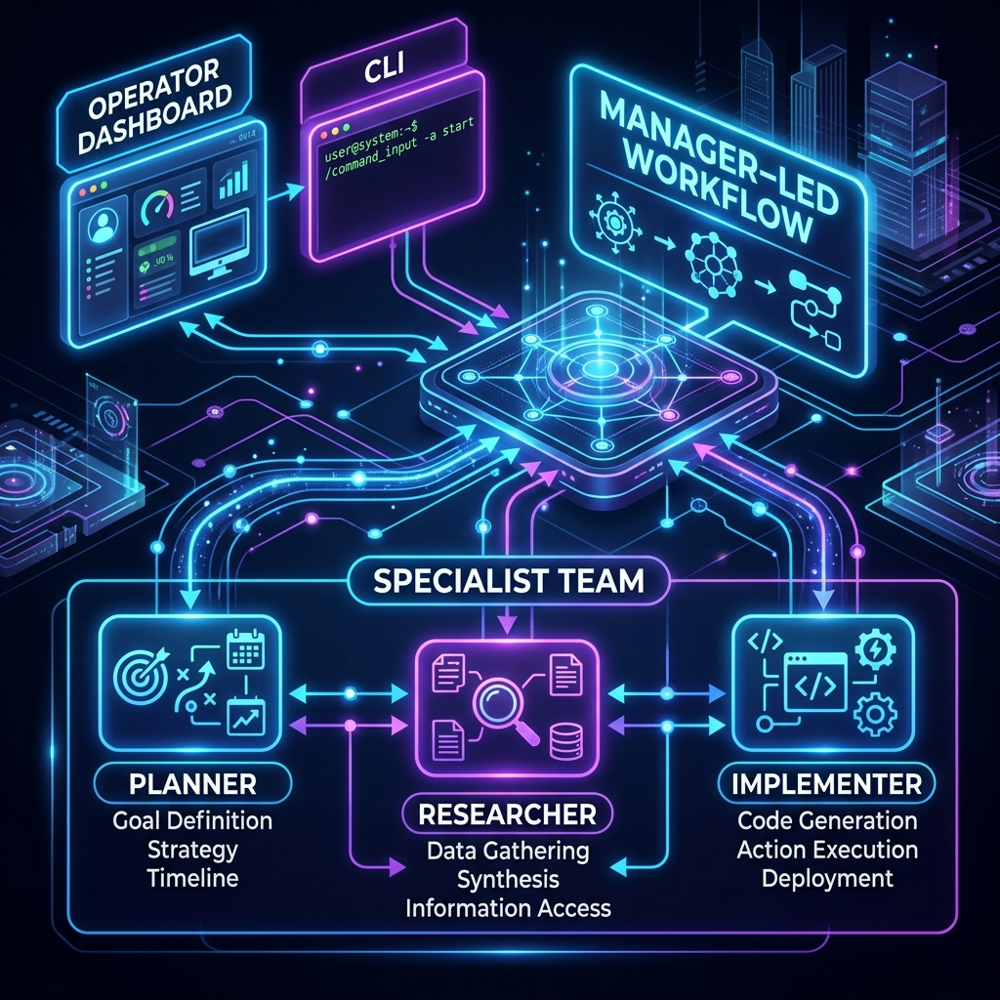

# Architecture

`autogen` utilizes a manager-led orchestration strategy built on top of the Microsoft Agent Framework. Its design emphasizes operator control and execution safety over pure autonomy.

## Workflow Orchestration Diagram



```mermaid
flowchart TD
    subgraph Operator[Operator / UI]
        Dashboard[Operator Dashboard]
        CLI[Command Line Interface]
    end

    subgraph Manager[Manager Agent]
        Workflow[Manager-Led Workflow]
        Approval[Approval Gate]
        Validation[Validation Step]
    end
    
    subgraph Specialists[Specialist Team]
        Planner[Planner Agent\n(gemini-2.5-pro)]
        Researcher[Researcher Agent\n(gemini-2.5-flash)]
        Implementer[Implementer Agent\n(gemini-2.5-pro)]
        Reviewer[Reviewer Agent\n(gemini-2.5-pro)]
    end

    subgraph State[Run Artifacts & State]
        Checkpoints[Run-Scoped Checkpoints]
        SessionStore[Durable Session Store]
    end

    subgraph Boundaries[Repo Boundaries]
        RepoTools[Bounded Repo Tools]
        LocalFiles[File System]
    end

    Dashboard <--> Workflow
    CLI <--> Workflow

    Workflow --> Planner
    Planner --Handoff--> Researcher
    Researcher --Handoff--> Implementer
    Implementer --Handoff--> Reviewer
    Reviewer --Handoff--> Validation

    Planner --> Checkpoints
    Researcher --> RepoTools
    Implementer --> RepoTools
    Reviewer --> RepoTools

    RepoTools --> LocalFiles
    RepoTools --> Approval
    Approval -.-> Dashboard

    Validation --> SessionStore
    Checkpoints --> SessionStore
```

## Component Breakdown

### Manager-Led Workflow
The entry point (`entities/repo_team/workflow.py`) defines a canonical sequence: `planning` -> `research` -> `implementation` -> `review` -> `validation`. 

### The Specialists
Agents are built in `maf_starter/team_factory.py` with distinct models and roles:
- **Planner**: Scopes the work, generates constraints, sets risks and assumptions.
- **Researcher**: Gathers facts from the repository using bounded tools.
- **Implementer**: Translates plans and research into a concrete technical change.
- **Reviewer**: Inspects the implementation for regressions, missing tests, or weak assumptions.

### Bounded Repo Operations and Approvals
Tools restrict file accesses and enforce boundaries. Actions like file writes or executing validation commands pass through an `Approval Gate` ensuring destructive changes pause for human operator review in the dashboard.

### Provider Fallback & Routing
Built for resilience, tasks are routed across APIs (e.g., Gemini, Anthropic) or CLI fallbacks based on policy definitions.
