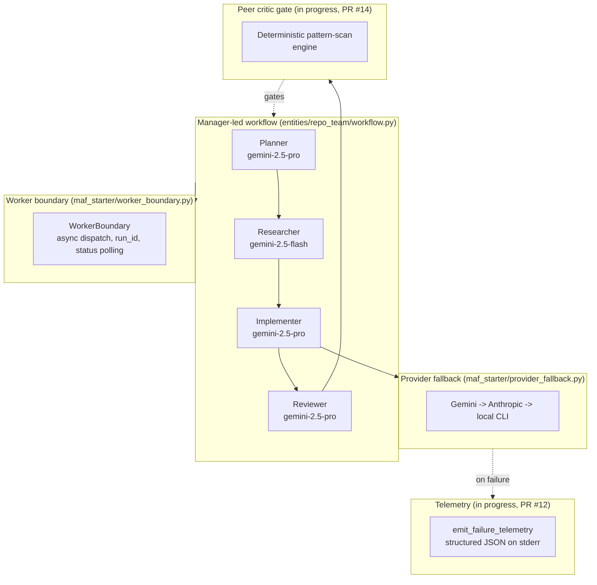

# Architecture

## Worker fan-out + telemetry boundary + critic gate

<!-- codex:generate-image prompt="A factory floor with a manager robot dispatching four numbered worker robots (Planner, Researcher, Implementer, Reviewer) through a glass boundary wall; failed work items trigger a small telemetry beacon; a fifth robot with a magnifying glass (the critic) inspects finished work at a gate before it passes through; isometric, enterprise blue/graphite palette" style="isometric, enterprise, clean" replaces="mermaid-above" -->

## Worker fan-out (landed on `main`)

`entities/repo_team/workflow.py` wires the canonical `planning -> research -> implementation ->
review -> validation` sequence via `agent_framework_orchestrations.SequentialBuilder`. Each
specialist is built in `maf_starter/team_factory.py` with a distinct model tier. Long-running
executions are dispatched through `WorkerBoundary` (`maf_starter/worker_boundary.py`), which
returns a `run_id` immediately and exposes `pending` / `running` / `done` / `error:<msg>`
status polling instead of blocking HTTP ingress on the full execution path.

## Telemetry boundary — in progress (PR #12)

`main` today does not have a `maf_starter/telemetry.py` module. PR #12
(`feat(28-02): structured JSON failure telemetry + CLI fallback size guards`) adds
`emit_failure_telemetry(event, **fields)` — a stdlib-only, never-raising function that writes
one flushed JSON line to stderr — wired into `provider_fallback.py`'s fallback middleware at
`provider_failed`, `fallback_step_failed`, `fallback_succeeded`, and `fallback_exhausted`
points, plus a 1MB CLI output/prompt size guard. Until merged, provider-fallback failures are
still caught (existing `except Exception` boundaries in `provider_fallback.py` and
`worker_boundary.py`) but not emitted as structured telemetry.

## Critic gate — in progress (PR #14)

No critic module exists on `main` yet. PR #14
(`feat(29-01): deterministic peer critic pattern-scan engine`) introduces a deterministic
pattern-scan reviewer intended to sit after the Reviewer specialist as an additional gate.
Until merged, review is limited to the LLM-based Reviewer agent's own assessment.

## Provider routing and fallback (landed on `main`)

`maf_starter/routing_policy.py` selects a model tier by task depth; `maf_starter/
provider_fallback.py` retries across the Gemini API, optional Anthropic API, and local CLI
providers (`gemini.cmd`, `claude`, `codex.cmd`) on heuristic quota/rate-limit errors, recording
route-attempt history.

## Approvals and bounded repo tools (landed on `main`)

`maf_starter/tools.py` enforces repo-root path boundaries and blocks writes to sensitive
targets (e.g. `.env`). `maf_starter/approval_policy.py` classifies file operations and
validation commands so destructive or externally visible actions pause for operator approval
via the dashboard's approval surface.

<!-- docs-verified: e52e6aa9383a11722bbf92f95c21ff39feb3dd65 2026-07-08 -->
